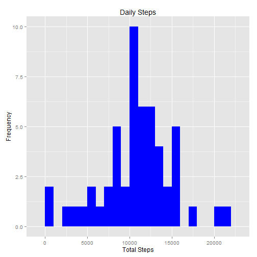
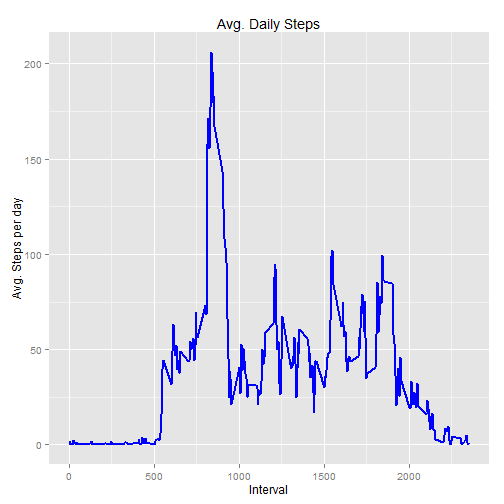
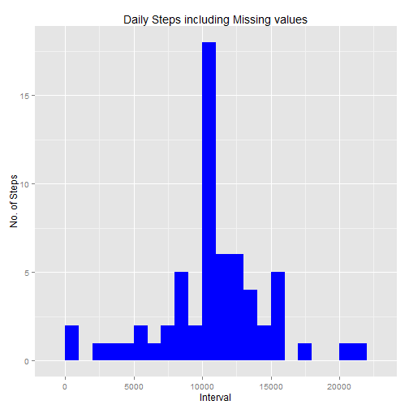
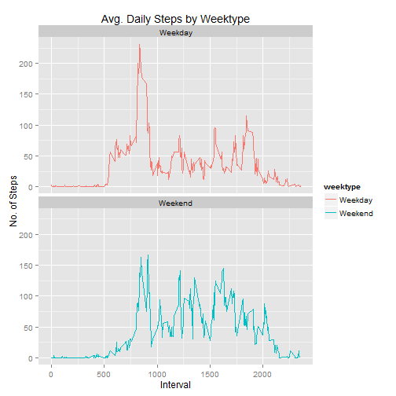

Reproducible Research Assignment: Course Project 1

###Loading and preprocessing the data:


```r
library(dplyr)
```

```
## 
## Attaching package: 'dplyr'
```

```
## The following objects are masked from 'package:stats':
## 
##     filter, lag
```

```
## The following objects are masked from 'package:base':
## 
##     intersect, setdiff, setequal, union
```

```r
setwd("C:/1. HP- Work files/HP WORK 1st Feb 2015/COURSERA_COURSES/5. Reproducible Research/Week1_Assignment")  
activitydata<- read.csv("C:/1. HP- Work files/HP WORK 1st Feb 2015/COURSERA_COURSES/5. Reproducible Research/Week1_Assignment/activity.csv")  
head(activitydata)  
```

```
##   steps       date interval
## 1    NA 2012-10-01        0
## 2    NA 2012-10-01        5
## 3    NA 2012-10-01       10
## 4    NA 2012-10-01       15
## 5    NA 2012-10-01       20
## 6    NA 2012-10-01       25
```

```r
dim(activitydata)  
```

```
## [1] 17568     3
```

```r
glimpse(activitydata)  
```

```
## Observations: 17,568
## Variables: 3
## $ steps    (int) NA, NA, NA, NA, NA, NA, NA, NA, NA, NA, NA, NA, NA, N...
## $ date     (fctr) 2012-10-01, 2012-10-01, 2012-10-01, 2012-10-01, 2012...
## $ interval (int) 0, 5, 10, 15, 20, 25, 30, 35, 40, 45, 50, 55, 100, 10...
```

```r
summary(activitydata)  
```

```
##      steps                date          interval     
##  Min.   :  0.00   2012-10-01:  288   Min.   :   0.0  
##  1st Qu.:  0.00   2012-10-02:  288   1st Qu.: 588.8  
##  Median :  0.00   2012-10-03:  288   Median :1177.5  
##  Mean   : 37.38   2012-10-04:  288   Mean   :1177.5  
##  3rd Qu.: 12.00   2012-10-05:  288   3rd Qu.:1766.2  
##  Max.   :806.00   2012-10-06:  288   Max.   :2355.0  
##  NA's   :2304     (Other)   :15840
```

```r
activitydata$date<- as.Date(activitydata$date)  ##covert chr to date
```


###What is mean total number of steps taken per day?


```r
##### 1.Calculate the total number of steps taken per day:
Total_Steps<- activitydata%>%
  group_by(date)%>%
        filter(!is.na(steps))%>%
        summarise(total_steps = sum(steps, na.rm=TRUE))
Total_Steps
```

```
## Source: local data frame [53 x 2]
## 
##          date total_steps
##        (date)       (int)
## 1  2012-10-02         126
## 2  2012-10-03       11352
## 3  2012-10-04       12116
## 4  2012-10-05       13294
## 5  2012-10-06       15420
## 6  2012-10-07       11015
## 7  2012-10-09       12811
## 8  2012-10-10        9900
## 9  2012-10-11       10304
## 10 2012-10-12       17382
## ..        ...         ...
```

```r
##### 2. Plot using ggplot:
library(ggplot2)

ggplot(Total_Steps, aes(x = total_steps)) +
        geom_histogram(fill = "blue", binwidth = 1000) +
        labs(title = "Daily Steps", x = "Total Steps", y = "Frequency")
```



```r
##### 3. Calculate and report the mean and median of the total number of steps taken per day:
Mean_Steps<- mean(Total_Steps$total_steps, na.rm=TRUE)
Mean_Steps
```

```
## [1] 10766.19
```

```r
Median_Steps<- median(Total_Steps$total_steps, na.rm=TRUE)
Median_Steps
```

```
## [1] 10765
```


### What is the average daily activity pattern?


```r
##### 1. Calculating Avg. Steps:
Interval<- activitydata%>%
        group_by(interval)%>%
        filter(!is.na(steps))%>%
        summarise(avg_steps = mean(steps, na.rm=TRUE))
Interval
```

```
## Source: local data frame [288 x 2]
## 
##    interval avg_steps
##       (int)     (dbl)
## 1         0 1.7169811
## 2         5 0.3396226
## 3        10 0.1320755
## 4        15 0.1509434
## 5        20 0.0754717
## 6        25 2.0943396
## 7        30 0.5283019
## 8        35 0.8679245
## 9        40 0.0000000
## 10       45 1.4716981
## ..      ...       ...
```

```r
##### 1.a Plotting Avg. Steps:
ggplot(Interval, aes(x =interval , y=avg_steps)) +
        geom_line(color="blue", size=1) +
        labs(title = "Avg. Daily Steps", x = "Interval", y = "Avg. Steps per day")
```



```r
##### 2. Which 5-minute interval, on average across all the days in the dataset, contains the maximum number of steps?
Interval[which.max(Interval$avg_steps),]
```

```
## Source: local data frame [1 x 2]
## 
##   interval avg_steps
##      (int)     (dbl)
## 1      835  206.1698
```

### Imputing missing values


```r
##### 1. Calculate total number of missing values in the dataset:
sum(is.na(activitydata$steps))
```

```
## [1] 2304
```

```r
##### 2. Imputing missing values using mean for each day and 3. Create a new dataset that is equal to the original dataset but with the missing data filled in:

activitydata2<- activitydata
nas<- is.na(activitydata2$steps)
avg_interval<- tapply(activitydata2$steps, activitydata2$interval, mean, na.rm=TRUE, simplify = TRUE)
activitydata2$steps[nas] <- avg_interval[as.character(activitydata2$interval[nas])]
names(activitydata2)
```

```
## [1] "steps"    "date"     "interval"
```

```r
##### 4. Check if no missing value is appearing:
sum(is.na(activitydata2))
```

```
## [1] 0
```

```r
##### 5. Reorder columns (for better understanding of the data):
activitydata2<- activitydata2[, c("date", "interval", "steps")]
head(activitydata2)
```

```
##         date interval     steps
## 1 2012-10-01        0 1.7169811
## 2 2012-10-01        5 0.3396226
## 3 2012-10-01       10 0.1320755
## 4 2012-10-01       15 0.1509434
## 5 2012-10-01       20 0.0754717
## 6 2012-10-01       25 2.0943396
```

### Create histogram of the total number of steps taken each day and Calculate mean and median total number of steps taken per day:


```r
Total_Steps2<- activitydata2%>%
        group_by(date)%>%
        summarise(total_steps = sum(steps, na.rm=TRUE))
Total_Steps2
```

```
## Source: local data frame [61 x 2]
## 
##          date total_steps
##        (date)       (dbl)
## 1  2012-10-01    10766.19
## 2  2012-10-02      126.00
## 3  2012-10-03    11352.00
## 4  2012-10-04    12116.00
## 5  2012-10-05    13294.00
## 6  2012-10-06    15420.00
## 7  2012-10-07    11015.00
## 8  2012-10-08    10766.19
## 9  2012-10-09    12811.00
## 10 2012-10-10     9900.00
## ..        ...         ...
```

```r
ggplot(Total_Steps2, aes(x = total_steps)) +
        geom_histogram(fill = "blue", binwidth = 1000) +
        labs(title = "Daily Steps including Missing values", x = "Interval", y = "No. of Steps")
```



```r
##### 4.2 Do these values differ from the estimates from the first part of the assignment? What is the impact of imputing missing data on the estimates of the total daily number of steps?
Mean_Steps2<- mean(Total_Steps2$total_steps, na.rm=TRUE)
Mean_Steps2
```

```
## [1] 10766.19
```

```r
Median_Steps2<- median(Total_Steps2$total_steps, na.rm=TRUE)
Median_Steps2
```

```
## [1] 10766.19
```

```r
##### Ans: The impact of imputing missing data with the average number of steps in the same 5-min interval is that both the mean and the median are same : 10766.19
```

### Are there differences in activity patterns between weekdays and weekends?


```r
head(activitydata2)
```

```
##         date interval     steps
## 1 2012-10-01        0 1.7169811
## 2 2012-10-01        5 0.3396226
## 3 2012-10-01       10 0.1320755
## 4 2012-10-01       15 0.1509434
## 5 2012-10-01       20 0.0754717
## 6 2012-10-01       25 2.0943396
```

```r
##### 5.1 Create new varibale called WeekType for Weekday & Weekend:
activitydata2<- activitydata2%>%
        mutate(weektype= ifelse(weekdays(activitydata2$date)=="Saturday" | weekdays(activitydata2$date)=="Sunday", "Weekend", "Weekday"))

head(activitydata2)
```

```
##         date interval     steps weektype
## 1 2012-10-01        0 1.7169811  Weekday
## 2 2012-10-01        5 0.3396226  Weekday
## 3 2012-10-01       10 0.1320755  Weekday
## 4 2012-10-01       15 0.1509434  Weekday
## 5 2012-10-01       20 0.0754717  Weekday
## 6 2012-10-01       25 2.0943396  Weekday
```

```r
###### Plotting:
Interval2<- activitydata2%>%
        group_by(interval, weektype)%>%
        summarise(avg_steps2 = mean(steps, na.rm=TRUE))
head(Interval2)
```

```
## Source: local data frame [6 x 3]
## Groups: interval [3]
## 
##   interval weektype avg_steps2
##      (int)    (chr)      (dbl)
## 1        0  Weekday 2.25115304
## 2        0  Weekend 0.21462264
## 3        5  Weekday 0.44528302
## 4        5  Weekend 0.04245283
## 5       10  Weekday 0.17316562
## 6       10  Weekend 0.01650943
```

```r
plot<- ggplot(Interval2, aes(x =interval , y=avg_steps2, color=weektype)) +
       geom_line() +
       labs(title = "Avg. Daily Steps by Weektype", x = "Interval", y = "No. of Steps") +
       facet_wrap(~weektype, ncol = 1, nrow=2)
print(plot)
```



```r
#####Ans: During the weekday, the test object is more active earlier in the day but the object is more active throughout the weekends probably because the oject is working during the weekdays, hence moving less during the day.
```
